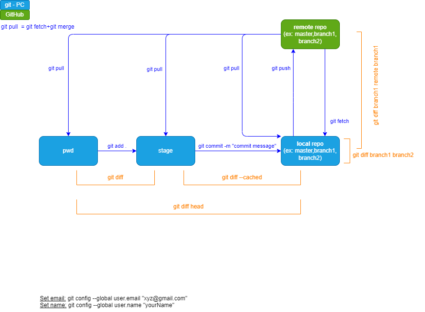

# Git & Gihub - Cheatsheet

## Git (Global Information Tracker) 

- What
  - an open source
    - so it is free to use and developers can modify the source code to suit their needs
  - distributed version-control system, for software development mainly.
    - meaning there is no central point of control
    - every computer is a full-fledged repository with complete history and full version-tracking abilities
  - but not a programming language
  - develop by **Linus Torvalds** in 2005
- Why
  - Collaboration
    - allows multiple developers to work on the same project at the same time without interfering with one another
  - Branching
    - allows developers to create branches of a project, so they can make changes without affecting the main version of the project.
  - Speed
    - fast and efficient system which allows developers to work quickly and seamlessly on projects
  - Security
    - uses encryption to secure data transfer and storage, which helps keep sensitive information safe.

## Github 

- What
  - A platform for code hosting and collaborating on projects using git.
  - It serves as a location for uploading copies of a Git repository.
- Why
  - makes it easy for developers to share code files and collaborate with fellow developers
  - also serves as a social networking site where developers can openly network, collaborate, and pitch their work

## Workflow

<u>Git&GitHub workflow</u>

### One time commands

- [`git init`](## "initialize an existing directory as a Git repository")
- [`git config --global user.email "xyz@gmail.com"`](## "set an email address that will be associated with each history marker")
- [`git config --global user.name "yourName"`](## "set a name that is identifiable for credit when review version history")
- [`git remote add origin <url (http or SHH)>`](## "add a remote repository")
- [`git clone <url (http or SHH)>`](## "retrieve an entire repository from a hosted location via URL")

### Frequently used commands

- [`git status`](## "show modified files in working directory, staged for your next commit")
- [`git log`](## "show the commit history for the currently active branch")
- [`git add .`](## "add a file as it looks now to your next commit (stage)")
- [`git commit -m "[descriptive message]"`](## "commit your staged content as a new commit snapshot")
- [`git diff`](## "diff of what is changed but not staged")
- [`git diff --staged`](## "diff of what is staged but not yet commited")
- [`git branch`](## "list your branches. a * will appear next to the currently active branch")
- [`git checkout`](## "switch to another branch and check it out into your working directory")
- [`git push [alias] [branch]`](## "Transmit local branch commits to the remote repository branch")
- [`git pull [alias] [branch]`](## "fetch and merge any commits from the tracking remote branch")
- [`git rebase [branch]`](## "apply any commits of current branch ahead of specified one")
